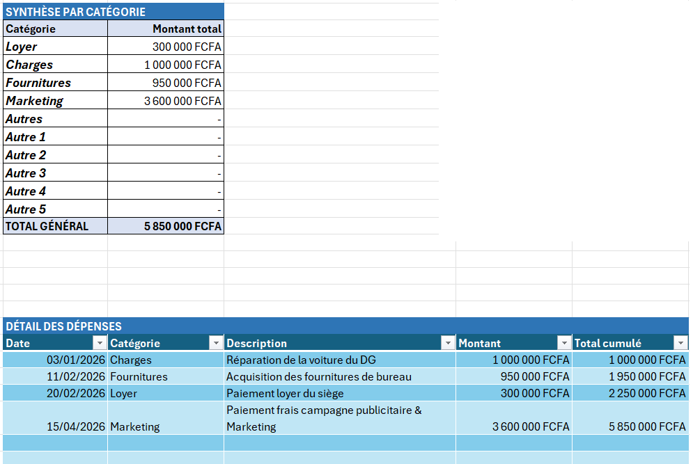

<a id="top"></a>

<p align="center">
  
</p>

<h1 align="center">
  Excel Budget Monitoring Dashboard
</h1>

<p align="center">
  <strong>Tableau de bord Excel de suivi des dépenses et de contrôle budgétaire</strong>
</p>

<p align="center">
  Financial Analysis • Budget Monitoring • KPI Reporting • Data Visualization
</p>

<p align="center">
  
  
  
  
</p>

<p align="center">
  
  
  
  
</p>

---

## Navigation

<p align="center">
  <a href="#francais">🇫🇷 Version française</a>
  •
  <a href="#english">🇬🇧 English version</a>
  •
  <a href="#dashboard-preview">📊 Aperçu</a>
  •
  <a href="#repository-structure">📁 Structure</a>
  •
  <a href="#author">👤 Auteur</a>
</p>

---

<a id="francais"></a>

# 🇫🇷 Version française

## Présentation du projet

Ce projet présente un tableau de bord développé avec Microsoft Excel pour assurer le suivi mensuel des dépenses et le contrôle de l’exécution budgétaire.

L’outil centralise les données financières, automatise les principaux calculs de gestion et transforme les informations enregistrées en indicateurs, tableaux de synthèse et graphiques exploitables.

Il permet notamment de comparer les budgets aux dépenses réelles, de calculer les écarts, d’observer l’évolution mensuelle des charges et d’identifier les catégories nécessitant une attention particulière.

---

## Contexte métier

Une organisation peut engager de nombreuses dépenses réparties entre plusieurs catégories : fournitures, services extérieurs, déplacements, personnel, fonctionnement et autres charges.

Sans outil de suivi structuré, il devient difficile de :

- connaître le niveau réel des dépenses ;
- comparer les réalisations au budget disponible ;
- repérer rapidement les dépassements ;
- identifier les catégories les plus importantes ;
- suivre l’évolution des dépenses dans le temps ;
- produire un reporting financier clair pour la direction.

Ce tableau de bord répond à ce besoin en proposant une vision centralisée, automatisée et visuelle de la situation budgétaire.

---

## Problématique

> Comment suivre les dépenses de manière régulière, comparer le budget aux réalisations et détecter rapidement les écarts nécessitant une action de gestion ?

---

## Objectifs du projet

Le projet poursuit les objectifs suivants :

- centraliser les informations relatives aux dépenses ;
- améliorer la fiabilité du suivi budgétaire ;
- automatiser les calculs récurrents ;
- comparer le budget aux dépenses réellement enregistrées ;
- mesurer les écarts budgétaires ;
- visualiser l’évolution mensuelle des dépenses ;
- analyser les dépenses par catégorie ;
- produire des commentaires de gestion ;
- faciliter la prise de décision financière.

---

## Fonctionnalités principales

| Fonctionnalité | Description |
|---|---|
| Saisie des dépenses | Enregistrement structuré des dates, catégories, libellés et montants |
| Synthèse par catégorie | Regroupement automatique des dépenses selon leur nature |
| Budget vs Réalisé | Comparaison du budget défini aux dépenses effectivement engagées |
| Calcul des écarts | Identification des montants disponibles ou des dépassements |
| Suivi mensuel | Analyse de l’évolution des dépenses au cours de la période |
| Indicateurs de performance | Présentation synthétique des informations financières importantes |
| Commentaires automatiques | Génération de messages facilitant l’interprétation des résultats |
| Visualisations | Graphiques permettant une lecture rapide de la situation |
| Mise en forme conditionnelle | Mise en évidence visuelle des écarts et situations sensibles |

---

## Indicateurs suivis

Le tableau de bord permet de suivre notamment :

- le budget total ;
- le montant total des dépenses ;
- le solde ou l’écart budgétaire ;
- le taux d’exécution du budget ;
- les dépenses par catégorie ;
- l’évolution mensuelle des dépenses ;
- les catégories présentant les montants les plus élevés ;
- les dépassements ou situations nécessitant une analyse complémentaire.

### Formules générales

```text
Écart budgétaire = Budget - Dépenses réelles
```

```text
Taux d’exécution = Dépenses réelles / Budget × 100
```

### Interprétation du taux d’exécution

| Situation | Interprétation |
|---|---|
| Taux inférieur à 100 % | Le budget n’est pas entièrement consommé |
| Taux égal à 100 % | Le budget est totalement exécuté |
| Taux supérieur à 100 % | Les dépenses dépassent le budget disponible |

---

<a id="dashboard-preview"></a>

## Aperçu du tableau de bord

### Vue générale et commentaires automatiques

<p align="center">
  
</p>

Cette vue présente les dépenses par catégorie ainsi que les principaux commentaires destinés à faciliter l’interprétation des données financières.

---

### Budget par catégorie : Budget vs Dépenses réelles

<p align="center">
  
</p>

Cette analyse permet de comparer le montant prévu pour chaque catégorie au montant effectivement dépensé et d’identifier les écarts budgétaires.

---

### Évolution mensuelle des dépenses

<p align="center">
  
</p>

Le graphique mensuel permet d’identifier les tendances, les pics de dépenses et les périodes nécessitant une investigation particulière.

---

### Table de saisie et synthèse par catégorie

<p align="center">
  
</p>

La table structurée constitue la base du projet. Les informations enregistrées alimentent automatiquement les synthèses et les visualisations.

---

## Méthodologie

### 1. Collecte et saisie

Les opérations sont enregistrées dans une table structurée comportant notamment :

- la date ;
- le libellé ;
- la catégorie ;
- le montant ;
- les éventuelles informations complémentaires.

### 2. Contrôle des données

Les données sont vérifiées afin de limiter :

- les cellules vides ;
- les erreurs de saisie ;
- les catégories incohérentes ;
- les dates incorrectes ;
- les montants non numériques ;
- les doublons éventuels.

### 3. Structuration

Les opérations sont organisées selon des catégories communes afin de permettre leur regroupement et leur analyse.

### 4. Calcul des indicateurs

Des formules Excel calculent automatiquement :

- les dépenses par catégorie ;
- les dépenses par mois ;
- les écarts budgétaires ;
- les taux d’exécution ;
- les résultats présentés dans le tableau de bord.

### 5. Visualisation

Les données synthétisées sont présentées sous forme :

- de tableaux ;
- de graphiques ;
- d’indicateurs ;
- de commentaires automatiques ;
- de mises en forme conditionnelles.

### 6. Interprétation

Les résultats permettent de détecter les catégories importantes, les variations mensuelles et les risques de dépassement budgétaire.

---

## Technologies utilisées

<p>
  
  
  
  
  
  
</p>

### Fonctions et outils Excel mobilisés

- tableaux structurés Excel ;
- tableaux croisés dynamiques ;
- graphiques ;
- `SOMME.SI` / `SUMIF` ;
- `SOMME.SI.ENS` / `SUMIFS` ;
- `RECHERCHEX` / `XLOOKUP` ;
- `SI` / `IF` ;
- `FIN.MOIS` / `EOMONTH` ;
- fonctions de date et de texte ;
- mise en forme conditionnelle ;
- validation et structuration des données ;
- calcul d’écarts et de taux.

---

## Compétences démontrées

- analyse financière ;
- contrôle budgétaire ;
- analyse de données ;
- préparation et structuration des données ;
- création de tableaux de bord ;
- automatisation de calculs ;
- définition et suivi de KPI ;
- visualisation des données ;
- reporting financier ;
- interprétation des résultats ;
- communication d’informations de gestion.

---

## Résultats et valeur ajoutée

Le tableau de bord permet :

- d’obtenir une vision consolidée des dépenses ;
- de réduire les calculs manuels répétitifs ;
- de détecter plus rapidement les dépassements ;
- de comparer les prévisions aux réalisations ;
- d’améliorer la lisibilité du reporting ;
- de faciliter les analyses mensuelles ;
- de renforcer la prise de décision budgétaire.

> Les résultats chiffrés dépendent des données saisies dans le classeur et de la période analysée.

---

## Mode d’utilisation

### Prérequis

- disposer de Microsoft Excel ;
- télécharger le fichier du projet ;
- autoriser la mise à jour des calculs si Excel le demande.

### Instructions

1. Téléchargez le fichier Excel présent dans le dépôt.
2. Ouvrez-le avec Microsoft Excel.
3. Accédez à la feuille consacrée à la saisie.
4. Enregistrez les nouvelles dépenses.
5. Utilisez les catégories prévues dans le modèle.
6. Vérifiez les montants et les dates.
7. Actualisez les tableaux croisés dynamiques si nécessaire.
8. Consultez les indicateurs et graphiques du tableau de bord.

### Téléchargement

Le fichier principal se trouve à la racine du dépôt :

```text
1- Tableau de Suivi mensuel des dépenses.xlsx
```

Pour le télécharger :

```text
Cliquez sur le fichier
→ Download raw file
```

---

<a id="repository-structure"></a>


## Structure du dépôt

```text
budget-monitoring-dashboard-excel/
│
├── README.md
├── LICENSE
├── 1- Tableau de Suivi mensuel des dépenses.xlsx
│
├── images/
│   ├── README.md
│   ├── banner.png
│   ├── budget-vs-actual.png
│   ├── dashboard-overview.png
│   ├── expense-data-table.png
│   ├── monthly-expenses.png
│   └── dashboard-demo.gif
│
├── data/
│   ├── README.md
│   └── sample-expenses.xlsx
│
└── docs/
    ├── README.md
    └── user-guide.pdf

---

## Confidentialité des données

Les données utilisées dans ce projet doivent être :

- simulées à des fins de démonstration ; ou
- anonymisées avant toute publication.

Aucune information confidentielle, donnée personnelle, information bancaire ou information interne sensible ne doit être publiée dans un dépôt public.

---

## Limites

- Le projet dépend de la qualité des données saisies.
- Les résultats peuvent être affectés par des catégories mal renseignées.
- Les analyses sont limitées à la période couverte par le fichier.
- Le classeur ne remplace pas un logiciel comptable ou un ERP.
- Les mises à jour peuvent nécessiter une actualisation des tableaux croisés dynamiques.
- Les prévisions et scénarios avancés ne sont pas encore intégrés.

---

## Améliorations futures

Les évolutions envisagées comprennent :

- intégration de Power Query ;
- ajout de segments interactifs ;
- analyse de Pareto des dépenses ;
- prévisions budgétaires ;
- suivi des engagements ;
- création d’un tableau de bord Power BI ;
- ajout d’un système d’alerte ;
- création d’un guide utilisateur ;
- ajout d’un GIF de démonstration ;
- amélioration de la documentation du projet.

---

<a id="english"></a>

# 🇬🇧 English version

## Project overview

This project presents a Microsoft Excel dashboard developed to monitor monthly expenses and evaluate budget execution.

The workbook centralizes financial information, automates recurring management calculations and transforms expense records into indicators, summary tables and visual reports.

It helps users compare planned budgets with actual expenses, calculate variances, monitor monthly spending trends and identify categories requiring management attention.

---

## Business context

Organizations record multiple expenses across categories such as supplies, external services, transportation, personnel and operating costs.

Without a structured monitoring system, management may find it difficult to:

- determine the actual level of expenses;
- compare spending with approved budgets;
- detect budget overruns;
- identify major expense categories;
- monitor spending trends;
- produce clear financial reports.

This dashboard provides a centralized and visual solution to support budget monitoring and financial decision-making.

---

## Business question

> How can an organization regularly monitor its expenses, compare budgeted and actual amounts, and quickly identify variances that require management action?

---

## Project objectives

- Centralize expense information
- Monitor expenses by category
- Compare budgeted and actual amounts
- Calculate budget variances
- Measure budget execution
- Analyze monthly spending trends
- Automate recurring calculations
- Improve financial reporting
- Support management decision-making

---

## Key features

| Feature | Description |
|---|---|
| Expense entry | Structured recording of dates, categories, descriptions and amounts |
| Category summary | Automatic aggregation of expenses by category |
| Budget vs Actual | Comparison between planned and actual spending |
| Variance analysis | Identification of available balances and overruns |
| Monthly tracking | Analysis of spending trends over time |
| KPI reporting | Summary presentation of major financial indicators |
| Automated comments | Messages supporting interpretation of results |
| Data visualization | Charts for clear and rapid analysis |
| Conditional formatting | Visual identification of significant variances |

---

## Methodology

1. Collection and structured recording of expense data
2. Data-quality checks
3. Standardization of expense categories
4. Automated calculation of financial indicators
5. Creation of summary tables and visualizations
6. Interpretation of budget variances and monthly trends

---

## Tools and skills

- Microsoft Excel
- Pivot Tables
- XLOOKUP
- SUMIF and SUMIFS
- IF and EOMONTH
- Conditional Formatting
- Charts and dashboards
- Financial Analysis
- Budget Monitoring
- Data Cleaning
- Data Visualization
- KPI Reporting

---

## Project value

The dashboard provides:

- centralized expense monitoring;
- reduced manual calculations;
- faster identification of budget overruns;
- improved comparison of planned and actual spending;
- clearer financial reporting;
- better support for management decisions.

---

## Future improvements

- Power Query integration
- Interactive slicers
- Pareto expense analysis
- Budget forecasting
- Power BI version
- Automated alerts
- User documentation
- Animated dashboard demonstration

---

<a id="author"></a>

# 👤 Auteur | Author

## Kossi Olivier DASSILENOU

**Accounting and Tax Consultant | Financial Analyst | Data Analyst | SAP FICO Consultant**

Professionnel de la finance, de la comptabilité et de l’analyse de données, spécialisé dans le contrôle budgétaire, le reporting financier, Microsoft Excel et SAP FICO.

### Contact

- GitHub : `https://github.com/kdassilenou`
- LinkedIn : https://www.linkedin.com/in/kossi-olivier-dassilenou-consultant-sap-fico-98b279193/
- E-mail professionnel : olivierdassilenou@gmail.com

---

<p align="center">
  Projet réalisé dans le cadre d’un portfolio professionnel en analyse de données et finance.
</p>

<p align="center">
  <a href="#top">⬆ Retour en haut | Back to top</a>
</p>
