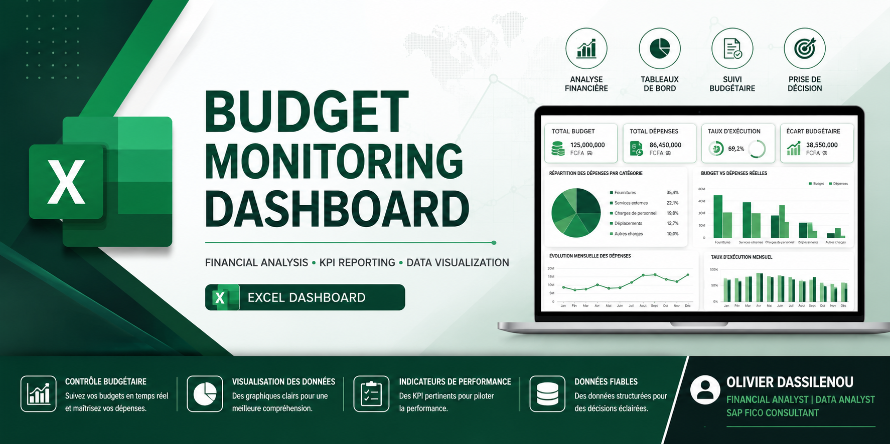
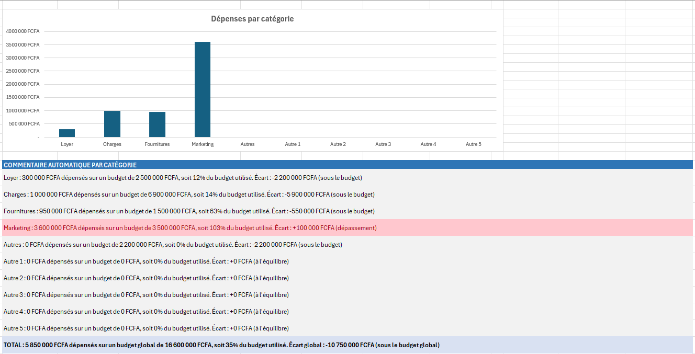
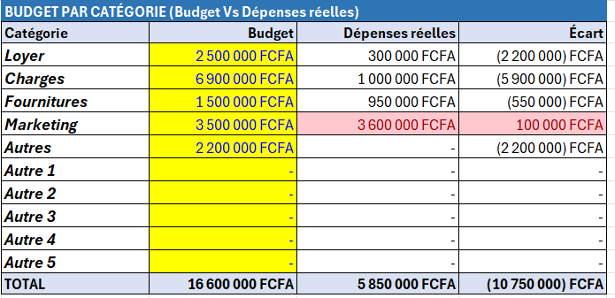
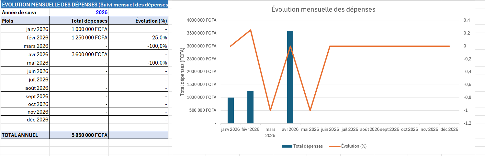

<p align="center">
  
</p>

# 📊 Excel Expense Monitoring Dashboard | Tableau de Bord de Suivi des Dépenses
# 📊 Excel Expense Monitoring Dashboard | Tableau de Bord de Suivi des Dépenses


---

# 🇬🇧 English

## Project Overview

This project consists of an interactive Microsoft Excel dashboard designed to monitor business expenses, compare actual spending against budget, and support financial decision-making.

The dashboard transforms raw expense records into actionable financial insights through automated calculations, dynamic summaries, and visual reporting.

---

## Business Context

Organizations generate hundreds or thousands of expense transactions every year.

Without a structured monitoring system, it becomes difficult to:

- identify the largest expense categories;
- detect budget overruns;
- monitor monthly spending trends;
- support management decisions.

This dashboard addresses these challenges by providing a centralized financial monitoring solution.

---

## Objectives

- Monitor expenses by category
- Compare Budget vs Actual Expenses
- Calculate budget variances automatically
- Track monthly expense evolution
- Improve financial reporting
- Support management decision-making

---

## Dashboard Features

✔ Expense monitoring by category

✔ Budget vs Actual comparison

✔ Automatic variance calculation

✔ Monthly expense evolution

✔ Dynamic financial indicators

✔ Automated calculations

✔ Professional dashboard layout

✔ Financial reporting

---

## Methodology

### 1. Data Collection

Expense transactions are entered into a structured Excel table.

### 2. Data Processing

The dashboard automatically calculates:

- Total expenses
- Budget execution
- Monthly totals
- Variances
- Financial indicators

### 3. Data Visualization

Results are presented through:

- Summary tables
- Charts
- Budget comparison
- Monthly trends

---

## Excel Functions Used

- SUMIF
- SUMIFS
- IF
- EOMONTH
- Excel Tables
- Conditional Formatting
- Charts
- Dashboard Design

---

## Skills Demonstrated

- Financial Analysis
- Budget Monitoring
- Business Analysis
- Dashboard Design
- Data Cleaning
- Data Visualization
- Excel Automation
- KPI Reporting

---

## Repository Structure

```
📂 excel-expense-dashboard

│
├── README.md
├── Tableau de Suivi mensuel des dépenses.xlsx
├── images/
│     dashboard-overview.png
│     budget-vs-actual.png
│     monthly-expenses.png
│
└── LICENSE
```

---

## Dashboard Preview

### Main Dashboard



---

### Budget vs Actual



---

### Monthly Expenses



---

## Future Improvements

- Power Query integration
- Pivot Charts
- Power BI version
- Interactive slicers
- Forecasting module
- Pareto Analysis (80/20)

---

# 🇫🇷 Français

## Présentation du projet

Ce projet est un tableau de bord Excel interactif permettant le suivi des dépenses d'une organisation et le contrôle de l'exécution budgétaire.

L'outil automatise les calculs financiers et fournit une vision claire des dépenses grâce à des tableaux de synthèse et des graphiques.

---

## Contexte métier

Les entreprises effectuent quotidiennement de nombreuses dépenses.

Sans tableau de bord, il devient difficile :

- d'identifier les postes les plus coûteux ;
- de suivre l'exécution du budget ;
- de détecter rapidement les dépassements ;
- d'analyser les tendances mensuelles.

Ce tableau de bord répond à ces besoins.

---

## Objectifs

- Suivre les dépenses par catégorie
- Comparer Budget et Réalisé
- Calculer automatiquement les écarts
- Visualiser l'évolution mensuelle
- Produire un reporting financier fiable
- Faciliter la prise de décision

---

## Fonctionnalités

✅ Synthèse des dépenses par catégorie

✅ Comparatif Budget vs Dépenses réelles

✅ Calcul automatique des écarts

✅ Suivi mensuel des dépenses

✅ Tableau de bord dynamique

✅ Indicateurs financiers

✅ Restitution graphique

---

## Méthodologie

### Collecte

Les dépenses sont enregistrées dans une table Excel structurée.

### Traitement

Le tableau calcule automatiquement :

- les dépenses par catégorie ;
- les dépenses mensuelles ;
- les écarts budgétaires ;
- les indicateurs de suivi.

### Analyse

Les résultats sont restitués sous forme :

- de tableaux de synthèse ;
- de graphiques ;
- d'indicateurs financiers.

---

## Compétences mobilisées

- Excel avancé
- Analyse financière
- Contrôle budgétaire
- Tableaux de bord
- Nettoyage de données
- Reporting
- Visualisation des données

---

## Technologies

- Microsoft Excel
- Tableaux Excel
- SUMIF
- SUMIFS
- IF
- EOMONTH
- Mise en forme conditionnelle
- Graphiques
- Dashboard

---

## Aperçu

### Tableau de bord


---

### Budget vs Réalisé


---

### Évolution mensuelle


---

## Auteur

**Olivier DASSILENOU**

Financial Analyst | SAP FICO Consultant | Data Analyst

LinkedIn : *(Ajout# 📊 Excel Expense Monitoring Dashboard | Tableau de Bord de Suivi des Dépenses


---

# 🇬🇧 English

## Project Overview

This project consists of an interactive Microsoft Excel dashboard designed to monitor business expenses, compare actual spending against budget, and support financial decision-making.

The dashboard transforms raw expense records into actionable financial insights through automated calculations, dynamic summaries, and visual reporting.

---

## Business Context

Organizations generate hundreds or thousands of expense transactions every year.

Without a structured monitoring system, it becomes difficult to:

- identify the largest expense categories;
- detect budget overruns;
- monitor monthly spending trends;
- support management decisions.

This dashboard addresses these challenges by providing a centralized financial monitoring solution.

---

## Objectives

- Monitor expenses by category
- Compare Budget vs Actual Expenses
- Calculate budget variances automatically
- Track monthly expense evolution
- Improve financial reporting
- Support management decision-making

---

## Dashboard Features

✔ Expense monitoring by category

✔ Budget vs Actual comparison

✔ Automatic variance calculation

✔ Monthly expense evolution

✔ Dynamic financial indicators

✔ Automated calculations

✔ Professional dashboard layout

✔ Financial reporting

---

## Methodology

### 1. Data Collection

Expense transactions are entered into a structured Excel table.

### 2. Data Processing

The dashboard automatically calculates:

- Total expenses
- Budget execution
- Monthly totals
- Variances
- Financial indicators

### 3. Data Visualization

Results are presented through:

- Summary tables
- Charts
- Budget comparison
- Monthly trends

---

## Excel Functions Used

- SUMIF
- SUMIFS
- IF
- EOMONTH
- Excel Tables
- Conditional Formatting
- Charts
- Dashboard Design

---

## Skills Demonstrated

- Financial Analysis
- Budget Monitoring
- Business Analysis
- Dashboard Design
- Data Cleaning
- Data Visualization
- Excel Automation
- KPI Reporting

---

## Repository Structure

```
📂 excel-expense-dashboard

│
├── README.md
├── Tableau de Suivi mensuel des dépenses.xlsx
├── images/
│     dashboard-overview.png
│     budget-vs-actual.png
│     monthly-expenses.png
│
└── LICENSE
```

---

## Dashboard Preview

### Main Dashboard


---

### Budget vs Actual


---

### Monthly Expenses


---

## Future Improvements

- Power Query integration
- Pivot Charts
- Power BI version
- Interactive slicers
- Forecasting module
- Pareto Analysis (80/20)

---

# 🇫🇷 Français

## Présentation du projet

Ce projet est un tableau de bord Excel interactif permettant le suivi des dépenses d'une organisation et le contrôle de l'exécution budgétaire.

L'outil automatise les calculs financiers et fournit une vision claire des dépenses grâce à des tableaux de synthèse et des graphiques.

---

## Contexte métier

Les entreprises effectuent quotidiennement de nombreuses dépenses.

Sans tableau de bord, il devient difficile :

- d'identifier les postes les plus coûteux ;
- de suivre l'exécution du budget ;
- de détecter rapidement les dépassements ;
- d'analyser les tendances mensuelles.

Ce tableau de bord répond à ces besoins.

---

## Objectifs

- Suivre les dépenses par catégorie
- Comparer Budget et Réalisé
- Calculer automatiquement les écarts
- Visualiser l'évolution mensuelle
- Produire un reporting financier fiable
- Faciliter la prise de décision

---

## Fonctionnalités

✅ Synthèse des dépenses par catégorie

✅ Comparatif Budget vs Dépenses réelles

✅ Calcul automatique des écarts

✅ Suivi mensuel des dépenses

✅ Tableau de bord dynamique

✅ Indicateurs financiers

✅ Restitution graphique

---

## Méthodologie

### Collecte

Les dépenses sont enregistrées dans une table Excel structurée.

### Traitement

Le tableau calcule automatiquement :

- les dépenses par catégorie ;
- les dépenses mensuelles ;
- les écarts budgétaires ;
- les indicateurs de suivi.

### Analyse

Les résultats sont restitués sous forme :

- de tableaux de synthèse ;
- de graphiques ;
- d'indicateurs financiers.

---

## Compétences mobilisées

- Excel avancé
- Analyse financière
- Contrôle budgétaire
- Tableaux de bord
- Nettoyage de données
- Reporting
- Visualisation des données

---

## Technologies

- Microsoft Excel
- Tableaux Excel
- SUMIF
- SUMIFS
- IF
- EOMONTH
- Mise en forme conditionnelle
- Graphiques
- Dashboard

---

## Aperçu

### Tableau de bord


---

### Budget vs Réalisé


---

### Évolution mensuelle


---

## Auteur

**Olivier DASSILENOU**

Financial Analyst | SAP FICO Consultant | Data Analyst

LinkedIn : *(https://www.linkedin.com/in/kossi-olivier-dassilenou-consultant-sap-fico-98b279193/)*

GitHub : *(https://github.com/kdassilenou)*

---
